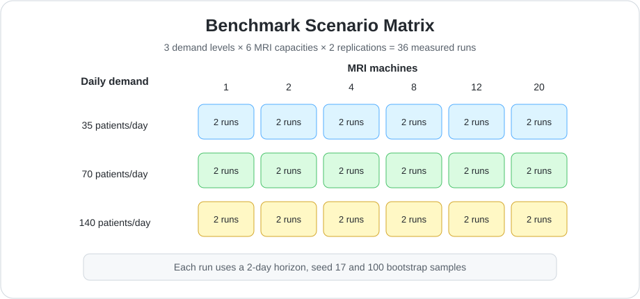
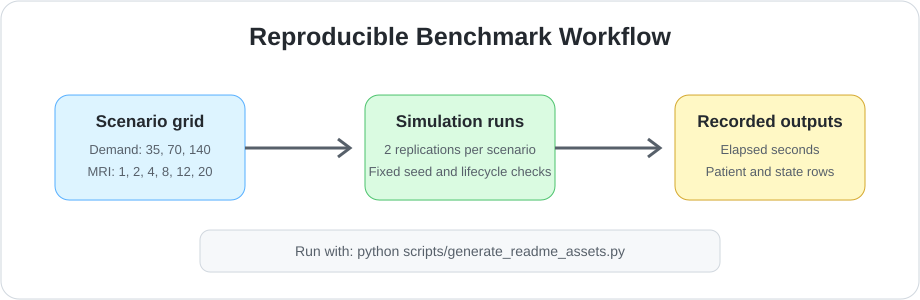
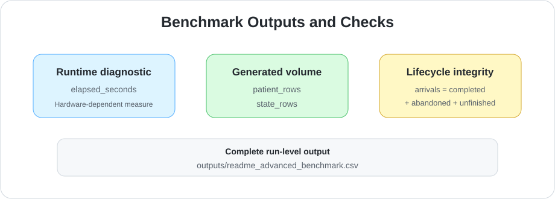
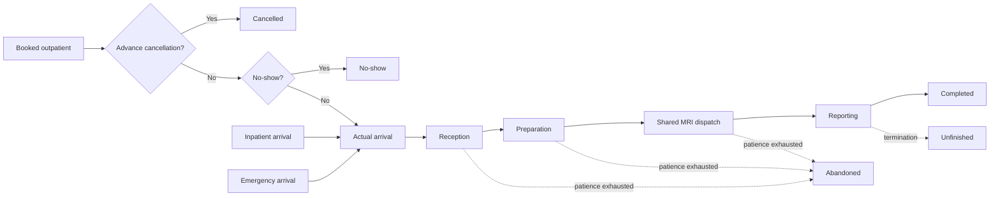

# Healthcare Discrete-Event Simulation

[](https://github.com/sauravsingla/healthcare-discrete-event-simulation/actions/workflows/ci.yml)
[](https://www.python.org/)
[](LICENSE)
[](https://doi.org/10.4236/ojmsi.2020.84007)

A research-grade Python healthcare digital twin for MRI demand forecasting, capacity planning, patient-flow simulation, queue analysis, resource utilisation, uncertainty analysis and transparent staffing optimisation.

This repository provides an implementation and research extension of Saurav Singla (2020), **Demand and Capacity Modelling in Healthcare Using Discrete Event Simulation**, *Open Journal of Modelling and Simulation*, 8, 88–107.

- [Research paper](https://www.scirp.org/journal/paperinformation?paperid=102869)
- [DOI](https://doi.org/10.4236/ojmsi.2020.84007)
- [Validation protocol](docs/VALIDATION.md)
- [Engine guide](docs/ENGINE_GUIDE.md)
- [Validation status](docs/VALIDATION_STATUS.md)

<p align="center">
  
</p>

## Why this project matters

Healthcare capacity decisions involve uncertain demand, patient priorities, shared resources, equipment downtime and queues that interact over time. This project converts those operational relationships into a reproducible discrete-event simulation so that alternative demand, machine, staffing and scheduling scenarios can be compared transparently before real-world implementation.

## At a glance

| Area | Capability |
|---|---|
| Demand | Outpatient, inpatient and 24-hour emergency arrivals |
| Patient flow | Reception, preparation, MRI scanning and reporting |
| Operational behaviour | Priorities, queues, cancellation, no-show, abandonment and unfinished patients |
| Capacity | MRI machines, radiographers, radiologists, clerks and dynamic staffing windows |
| Reliability | Maintenance, stochastic failure, repair and optional scan restart |
| Experimentation | Replications, bootstrap summaries, sensitivity analysis and scenario benchmarking |
| Delivery | Python package, four CLI entry points, Streamlit dashboard and Docker image |
| Quality | Linting, typing, coverage, wheel validation, Docker health checks and multi-version CI |

## Example decision outputs

A typical experiment produces:

- mean and stage-specific waiting time;
- mean system time;
- throughput per day;
- completion rate and service-level attainment;
- patient-type performance for outpatient, inpatient and emergency pathways;
- clerk, radiographer, MRI and radiologist utilisation;
- cancellation, no-show, abandonment and unfinished-patient counts;
- replication-level uncertainty and 95% confidence intervals;
- ranked capacity and staffing alternatives.

Generate deterministic machine-readable example outputs with:

```bash
python examples/generate_example_outputs.py
```

This writes:

```text
outputs/example_replications.csv
outputs/example_summary.csv
outputs/example_capacity_candidates.csv
```

Generate benchmark tables and charts with:

```bash
python scripts/generate_readme_assets.py
```

The generated assets include runtime scaling by demand and MRI capacity. They are diagnostics of software performance, not clinical validation findings.

## Reproducible benchmark results

The documentation benchmark exercises the advanced simulation engine across **18 demand-capacity scenarios** and **36 measured simulation runs**:

| Benchmark dimension | Values |
|---|---|
| Measurement horizon | 2 simulated days per run |
| Replications | 2 per scenario |
| Daily demand | 35, 70 and 140 patients |
| MRI capacity | 1, 2, 4, 8, 12 and 20 machines |
| Scenario combinations | 18 |
| Total measured runs | 36 |
| Random seed | 17, with deterministic replication offsets |
| Bootstrap samples | 100 per run |

The benchmark records elapsed runtime, generated patient-ledger rows and state-observation rows for every run. Its principal verification outcomes are:

- every benchmark scenario preserves the lifecycle reconciliation check `arrivals = completed + abandoned + unfinished`;
- all 18 demand-capacity combinations are executed with two deterministic replications;
- runtime, patient-ledger volume and state-observation volume are recorded for each run;
- CI verifies that the expected benchmark output files and metadata are produced.

<p align="center">
  
</p>

<p align="center">
  
</p>

<p align="center">
  
</p>

Reproduce the benchmark locally with:

```bash
python scripts/generate_readme_assets.py
```

The command writes the complete run-level results to:

```text
outputs/readme_advanced_benchmark.csv
```

For a configurable benchmark:

```bash
healthcare-des-advanced-benchmark \
  --days 7 \
  --replications 3 \
  --output outputs/advanced_benchmark.csv
```

> **Interpretation note:** elapsed time depends on the processor, operating system, Python environment and concurrent workload. The benchmark is intended to demonstrate reproducible scaling behaviour and output growth, not to claim a universal execution speed or clinical effectiveness.

## Current capabilities

- outpatient, inpatient and 24-hour emergency demand;
- reception, preparation, MRI scanning and reporting stages;
- patient-class priorities and shared MRI dispatching;
- stage-specific queue waits, service time and system time;
- cancellation, no-show, abandonment and unfinished-patient accounting;
- complete per-patient outcome ledger;
- weekday, monthly and hourly demand profiles;
- calendar-based simulation dates;
- dynamic staff-capacity windows;
- MRI maintenance, stochastic failure, repair and optional scan restart;
- capacity-aware outpatient scheduling and controlled overbooking;
- warm-up exclusion and configurable horizon/drain policies;
- operational-hours and 24-hour queue/capacity measures;
- deterministic replicated experiments and bootstrap summaries;
- scenario benchmarking, sensitivity analysis and calibration utilities;
- Streamlit dashboard and Docker deployment;
- linting, type checking, coverage, package-build and release-build workflows.

## Model architecture



`wait_minutes` is the sum of stage queue waits. `system_minutes` includes waiting and service time. Cancellation and no-show are recorded separately from patients who enter the physical service system.

## Which engine should I use?

| Engine | Intended use | Status |
|---|---|---|
| Base engine | Original YAML-driven workflow, standard scenario comparison and dashboard | Maintained for compatibility and straightforward experiments |
| Advanced engine | Rich lifecycle accounting, hourly demand, dynamic staffing, downtime, appointment schedules and configurable draining | Recommended for new research extensions |

See [docs/ENGINE_GUIDE.md](docs/ENGINE_GUIDE.md) for the detailed distinction and migration guidance.

## Installation

```bash
git clone https://github.com/sauravsingla/healthcare-discrete-event-simulation.git
cd healthcare-discrete-event-simulation
python -m venv .venv
source .venv/bin/activate  # Windows: .venv\Scripts\activate
pip install -e ".[dev,dashboard]"
```

## Advanced engine quick start

```python
from dataclasses import replace
from healthcare_des import AdvancedScenarioConfig, run_advanced_once

config = replace(
    AdvancedScenarioConfig(),
    name="advanced-example",
    days=14,
    warmup_days=2,
    daily_demand=70,
    mri_machines=4,
    termination_policy="bounded_drain",
    max_drain_minutes=720,
    seed=17,
)

result, patients, state = run_advanced_once(config)
print(result)
print(patients["status"].value_counts())
assert result.arrivals == result.completed + result.abandoned + result.unfinished
```

A complete example is available in [`examples/advanced_workflow.py`](examples/advanced_workflow.py).

## Termination policies

- `horizon`: stop at the measurement horizon and report unfinished patients.
- `bounded_drain`: stop arrivals and allow up to `max_drain_minutes` for completion.
- `drain`: stop arrivals and continue while active patients remain.

Use the same policy across scenarios unless termination is itself the experimental factor.

## Command-line simulation

```bash
healthcare-des --config configs/baseline.yaml --replications 20
```

## Multi-scenario benchmark

```bash
healthcare-des-benchmark \
  --config configs/baseline.yaml \
  --replications 20 \
  --output outputs/benchmark.csv
```

For advanced-engine runtime scaling:

```bash
python scripts/benchmark_advanced.py \
  --days 7 \
  --replications 3 \
  --output outputs/advanced_benchmark.csv
```

The scaling benchmark records elapsed runtime, patient-ledger size and state-observation size across demand levels and 1–20 MRI machines. It is a performance diagnostic, not a clinical validation result.

## KPI definitions

- **Booked:** outpatient appointments created before cancellation and no-show resolution.
- **Cancelled:** appointments cancelled before the scheduled arrival.
- **Expected arrivals:** booked appointments remaining after advance cancellation.
- **No-shows:** expected outpatients who do not enter the service system.
- **Arrivals:** patients who enter the simulated service system.
- **Completed:** arrivals finishing all stages.
- **Abandoned:** arrivals leaving before completion after exhausting patience.
- **Unfinished:** arrivals still active when the selected termination policy ends.
- **Completion rate:** completed divided by actual arrivals.
- **Stage waits:** queue delay before reception, preparation, MRI and reporting.
- **Total wait:** sum of stage-specific queue waits.
- **System time:** elapsed time from actual arrival to final outcome.
- **Operational queue/capacity measures:** state observations restricted to configured opening hours.
- **24-hour measures:** all state observations in the measured period.

The core reconciliation identity is:

```text
arrivals = completed + abandoned + unfinished
```

## Verification and validation status

| Area | Current status |
|---|---|
| Software verification | Implemented through deterministic tests, accounting checks and CI |
| Multi-version compatibility | Tested on Python 3.10, 3.11 and 3.12 |
| Package and CLI verification | Wheel build, clean installation and CLI smoke tests implemented |
| Dashboard deployment verification | Docker build and Streamlit health endpoint tested in CI |
| Repeated-experiment reproducibility | Fixed-seed and replication checks implemented |
| Independent observational validation | Protocol available; requires authoritative external observations |
| Exact 2020-paper reproduction | Not yet claimed while authoritative targets remain incomplete |
| Clinical deployment validation | Must be completed locally before operational use |

The public-data workflow uses aggregate external data and stores no patient-level confidential or employer-owned information. Blank expected values in `data/paper_targets_template.csv` deliberately indicate that authoritative published targets have not yet been transcribed. They must not be replaced with guessed values.

See [`docs/VALIDATION.md`](docs/VALIDATION.md) and [`docs/VALIDATION_STATUS.md`](docs/VALIDATION_STATUS.md) for holdout validation, statistical equivalence, warm-up handling and reproduction decision rules.

## Capacity optimisation

```python
from healthcare_des.model import ScenarioConfig
from healthcare_des.optimisation import search_capacity

candidates = search_capacity(
    ScenarioConfig(days=14, warmup_days=2, daily_demand=70),
    replications=8,
)
print(candidates.head())
```

The optimiser uses illustrative weights. Replace them with locally validated cost, safety and workforce assumptions before operational use.

## Monte Carlo and sensitivity analysis

```python
from healthcare_des.model import ScenarioConfig
from healthcare_des.sensitivity import monte_carlo, one_at_a_time

base = ScenarioConfig(days=14, warmup_days=2)
uncertainty = monte_carlo(base, samples=50, replications=4)
sensitivity = one_at_a_time(base, replications=10)
```

## Dashboard and Docker

```bash
streamlit run app.py
```

```bash
docker build -t healthcare-des .
docker run --rm -p 8501:8501 healthcare-des
```

The dashboard exposes scenario controls, KPI cards, confidence intervals, replication uncertainty, resource utilisation, patient-type performance, scenario comparison and capacity search.

## Testing and quality

```bash
pre-commit run --all-files
ruff check src tests scripts examples
mypy src/healthcare_des
pytest --cov=healthcare_des --cov-report=term-missing --cov-fail-under=80
python -m build
twine check dist/*

healthcare-des --help
healthcare-des-benchmark --help
healthcare-des-reproduce --help
healthcare-des-advanced-benchmark --help

python scripts/benchmark_advanced.py \
  --days 1 \
  --replications 1 \
  --output outputs/advanced_benchmark_ci.csv

docker build -t healthcare-des:ci .
```

CI runs the Python quality checks on Python 3.10, 3.11 and 3.12. It also executes all installed CLI entry points, validates an advanced-engine accounting smoke test, runs a bounded benchmark with output assertions, builds and installs the generated wheel in a clean environment, builds the Docker image, starts the container, and verifies the Streamlit health endpoint. Coverage, benchmark outputs and distributions are uploaded from Python 3.12.

A separate tag-triggered release workflow builds and validates source and wheel distributions. It deliberately does not publish to a package index without repository secrets and an explicit release decision.

## Assumptions and limitations

The project focuses on MRI patient flow rather than the entire radiology service. The advanced engine supports hourly demand, appointment schedules, downtime, cancellations, abandonment and dynamic staffing, but their default values remain illustrative until calibrated against authoritative local evidence.

Exact reproduction of the 2020 paper is not yet claimed while published scenario targets remain blank or incompletely transcribed. Real-world use additionally requires independent validation of clinical pathways, workforce rules, costs, safety constraints and governance requirements.

The model is a research and decision-support framework. It is not a clinical recommendation or a production scheduling system.

## Citation

```bibtex
@article{singla2020demand,
  title={Demand and Capacity Modelling in Healthcare Using Discrete Event Simulation},
  author={Singla, Saurav},
  journal={Open Journal of Modelling and Simulation},
  volume={8},
  pages={88--107},
  year={2020},
  doi={10.4236/ojmsi.2020.84007}
}
```

## Author

**Saurav Singla**

- [LinkedIn](https://www.linkedin.com/in/sauravsingla008/)
- [ORCID](https://orcid.org/0000-0002-6404-3988)