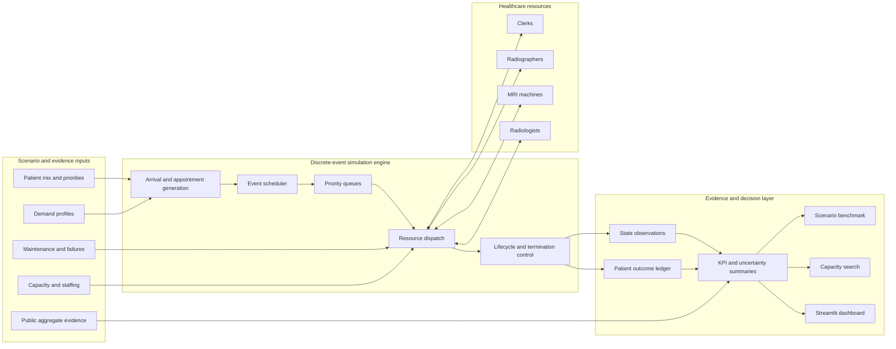
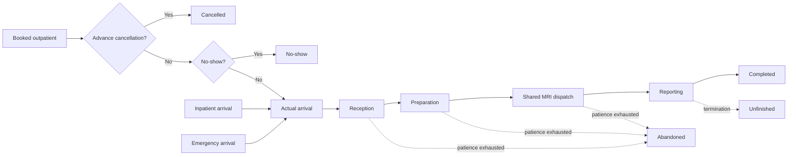

# Healthcare Discrete-Event Simulation

[](https://github.com/sauravsingla/healthcare-discrete-event-simulation/actions/workflows/ci.yml)
[](https://www.python.org/)
[](#testing-and-quality)
[](LICENSE)
[](https://doi.org/10.4236/ojmsi.2020.84007)
[](#dashboard-and-docker)
[](#research-lineage-original-paper-and-new-work)

A research-grade Python healthcare digital twin for MRI demand forecasting, capacity planning, patient-flow simulation, queue analysis, resource utilisation, uncertainty analysis and transparent staffing optimisation.

This repository modernises and extends Saurav Singla (2020), **Demand and Capacity Modelling in Healthcare Using Discrete Event Simulation**, *Open Journal of Modelling and Simulation*, 8, 88–107.

- [Research paper](https://www.scirp.org/journal/paperinformation?paperid=102869)
- [DOI](https://doi.org/10.4236/ojmsi.2020.84007)
- [Validation protocol](docs/VALIDATION.md)
- [Validation status](docs/VALIDATION_STATUS.md)
- [Engine guide](docs/ENGINE_GUIDE.md)
- [NHS benchmark evidence](docs/benchmarks/nhs/2026-08-02/README.md)
- [Roadmap](docs/ROADMAP.md)

<p align="center">
  
</p>

## Headline results

| Evidence | Result |
|---|---:|
| Official NHS providers represented | 463 |
| Provider-month MRI observations | 4,979 |
| National holdout actual MRI activity | 840,480 |
| National holdout predicted MRI activity | 821,577 |
| **National holdout WAPE** | **2.2491%** |
| Provider-level median WAPE | 13.0128% |
| Synthetic demand-capacity scenarios | 18 |
| Measured simulation runs | 36 |
| Supported Python versions | 3.10, 3.11 and 3.12 |
| Test coverage requirement | Minimum 80% |

**Plain-language interpretation:** on the unseen national holdout period, the benchmark differed from actual MRI activity by about **2 activities for every 100 delivered**. This is a strong aggregate forecasting result for short-term planning, while local provider performance remains more variable and should be recalibrated with local data.

## Research lineage: original paper and new work

### What the 2020 paper established

The original study used discrete-event simulation to examine healthcare demand and capacity for MRI services. It modelled the movement of patients through a constrained diagnostic pathway and showed how simulation can be used to study operational questions that are difficult to test safely in live services.

The paper's core contribution was the application of discrete-event simulation to:

- represent patient arrivals and service progression over time;
- model queues and waiting caused by constrained MRI capacity;
- compare demand with available service resources;
- evaluate alternative capacity scenarios before real-world implementation;
- support evidence-based operational planning through simulation rather than trial-and-error in a live hospital environment.

That work established the research foundation: **healthcare demand and capacity can be studied as a time-dependent system of arrivals, queues, resources and service events.**

### What this repository adds now

This repository turns that research idea into a modern, reusable and auditable healthcare simulation platform. The new work goes beyond the original paper implementation by adding:

- a production-style Python package with tested command-line interfaces;
- an advanced patient lifecycle covering cancellation, no-show, abandonment and unfinished patients;
- outpatient, inpatient and 24-hour emergency pathways sharing constrained resources;
- hourly and calendar-aware demand profiles;
- dynamic staffing and operating windows;
- planned maintenance, stochastic MRI failure, repair and optional scan restart;
- deterministic replications, bootstrap uncertainty and sensitivity analysis;
- capacity search and transparent optimisation utilities;
- patient-level simulation ledgers and system-state observations;
- a Streamlit dashboard and Docker deployment;
- multi-version continuous integration, package validation and an 80% coverage gate;
- an external benchmark pipeline using official NHS aggregate data;
- versioned benchmark evidence, source provenance and machine-readable outputs.

In simple terms, the **paper demonstrated the method**, while this repository develops it into a **validated, reproducible and extensible digital-twin framework**.

## Why this project matters

Healthcare capacity decisions involve uncertain demand, patient priorities, shared resources, staff availability, equipment downtime and queues that interact over time. These relationships cannot be understood reliably from simple averages alone.

This project provides a safe environment for comparing demand, machine, staffing and scheduling scenarios before operational changes are made. Assumptions, simulation logic, evidence and validation status are kept separate so that results can be reviewed, challenged and reproduced.

## What the platform models

| Area | Capability |
|---|---|
| Demand | Outpatient, inpatient and 24-hour emergency arrivals |
| Patient flow | Reception, preparation, MRI scanning and reporting |
| Operational behaviour | Priorities, queues, cancellation, no-show, abandonment and unfinished patients |
| Capacity | MRI machines, radiographers, radiologists, clerks and dynamic staffing windows |
| Reliability | Maintenance, stochastic failure, repair and optional scan restart |
| Experimentation | Replications, bootstrap summaries, sensitivity analysis and scenario benchmarking |
| Public evidence | NHS aggregate-data preparation, provenance and benchmark workflows |
| Delivery | Python package, four CLI entry points, Streamlit dashboard and Docker image |
| Quality | Linting, typing, coverage gate, wheel validation, Docker checks and multi-version CI |

## Official NHS external benchmark

The repository includes an end-to-end external benchmark using official public NHS aggregate data. The pipeline performs source acquisition, checksums, schema discovery, provider-month MRI extraction, leakage-free temporal holdout, baseline comparison, provider-level scoring, optional scanner-capacity matching and machine-readable report generation.

### Published results

| External benchmark measure | Published result |
|---|---:|
| Monthly DM01 MRI activity tables | 12 |
| Providers represented | 463 |
| Months represented | 11 |
| Provider-month rows | 4,979 |
| Rows matched to MRI scanner capacity | 1,480 |
| Selected leakage-free baseline | `lag_1` |
| Validation WAPE — `lag_1` | 6.7826% |
| Validation WAPE — trailing three-month mean | 6.8400% |
| National holdout actual MRI activity | 840,480 |
| National holdout predicted MRI activity | 821,577 |
| National holdout absolute difference | 18,903 |
| **National holdout WAPE** | **2.2491%** |

### Easy interpretation

The benchmark asks a practical question: **how closely can near-term MRI demand be estimated from recent observed activity?**

The previous month's activity (`lag_1`) marginally outperformed the trailing three-month average during validation. On the unseen national holdout period, the estimate was 821,577 MRI activities compared with 840,480 actually recorded.

This means:

- the national aggregate forecast followed overall MRI demand closely;
- recent activity was the strongest short-term signal among the tested transparent baselines;
- the result is useful as a planning reference for large systems and networks;
- it is not an exact forecast for every provider, day or patient pathway;
- provider-level error is naturally more volatile, especially for low-volume organisations.

Provider-level WAPE was available for 289 providers with positive holdout activity. The median was 13.0128%; 68.5% were at or below 20% WAPE and 90.0% were at or below 50% WAPE.

The retained evidence records workflow run `30742975228`, source commit `b036068`, artifact ID `8831932312`, and artifact SHA-256 `4a91bc13ae9a038718f5591290189cd39dc9a97427078c123a311bf963a705fe`.

Full evidence and machine-readable metadata are available in [`docs/benchmarks/nhs/2026-08-02/`](docs/benchmarks/nhs/2026-08-02/README.md).

> This is external observational validation of the forecasting and evidence pipeline. It is not patient-level or clinical validation of the discrete-event simulation.

## Reproducible simulation benchmark

The advanced engine is also tested across three synthetic workload levels and six MRI-capacity configurations.

| Workload | Daily demand | MRI capacities | Scenario combinations | Measured runs |
|---|---:|---|---:|---:|
| Low demand | 35 patients/day | 1, 2, 4, 8, 12 and 20 | 6 | 12 |
| Baseline demand | 70 patients/day | 1, 2, 4, 8, 12 and 20 | 6 | 12 |
| Stress demand | 140 patients/day | 1, 2, 4, 8, 12 and 20 | 6 | 12 |
| **Total** | **3 workloads** | **6 capacities each** | **18** | **36** |

All scenarios completed successfully and preserve the accounting identity:

```text
arrivals = completed + abandoned + unfinished
```

The benchmark confirms deterministic execution, lifecycle reconciliation and operational stability across constrained, intermediate and deliberately over-provisioned configurations. These are synthetic engineering tests, not independent clinical datasets.

## System architecture



## Patient-flow model



`wait_minutes` is the sum of stage queue waits. `system_minutes` includes waiting and service time. Cancellation and no-show are recorded separately from patients who enter the physical service system.

## Quick start

```bash
git clone https://github.com/sauravsingla/healthcare-discrete-event-simulation.git
cd healthcare-discrete-event-simulation
python -m venv .venv
source .venv/bin/activate  # Windows: .venv\Scripts\activate
pip install -e ".[dev,dashboard]"
healthcare-des --config configs/baseline.yaml --replications 20
```

Launch the dashboard:

```bash
streamlit run app.py
```

## Command-line applications

```bash
healthcare-des --help
healthcare-des-benchmark --help
healthcare-des-reproduce --help
healthcare-des-advanced-benchmark --help
```

Run a scenario:

```bash
healthcare-des --config configs/baseline.yaml --replications 20
```

Run a multi-scenario benchmark:

```bash
healthcare-des-benchmark \
  --config configs/baseline.yaml \
  --replications 20 \
  --output outputs/benchmark.csv
```

Run the advanced benchmark:

```bash
healthcare-des-advanced-benchmark \
  --days 7 \
  --replications 3 \
  --output outputs/advanced_benchmark.csv
```

## Advanced engine example

```python
from dataclasses import replace
from healthcare_des import AdvancedScenarioConfig, run_advanced_once

config = replace(
    AdvancedScenarioConfig(),
    name="advanced-example",
    days=14,
    warmup_days=2,
    daily_demand=70,
    mri_machines=4,
    termination_policy="bounded_drain",
    max_drain_minutes=720,
    seed=17,
)

result, patients, state = run_advanced_once(config)
print(result)
print(patients["status"].value_counts())
assert result.arrivals == result.completed + result.abandoned + result.unfinished
```

See [`examples/advanced_workflow.py`](examples/advanced_workflow.py) for a complete example.

## Decision outputs

A typical experiment produces:

- stage-specific and total waiting time;
- mean system time;
- throughput and completion rate;
- service-level attainment;
- patient-type performance;
- resource utilisation;
- cancellation, no-show, abandonment and unfinished counts;
- replication uncertainty and 95% confidence intervals;
- ranked capacity and staffing alternatives.

## Capacity optimisation

```python
from healthcare_des.model import ScenarioConfig
from healthcare_des.optimisation import search_capacity

candidates = search_capacity(
    ScenarioConfig(days=14, warmup_days=2, daily_demand=70),
    replications=8,
)
print(candidates.head())
```

The optimiser uses illustrative weights. Replace them with locally validated cost, safety and workforce assumptions before operational use.

## Monte Carlo and sensitivity analysis

```python
from healthcare_des.model import ScenarioConfig
from healthcare_des.sensitivity import monte_carlo, one_at_a_time

base = ScenarioConfig(days=14, warmup_days=2)
uncertainty = monte_carlo(base, samples=50, replications=4)
sensitivity = one_at_a_time(base, replications=10)
```

## Dashboard and Docker

```bash
streamlit run app.py
```

```bash
docker build -t healthcare-des .
docker run --rm -p 8501:8501 healthcare-des
```

The dashboard exposes scenario controls, KPI cards, confidence intervals, replication uncertainty, resource utilisation, patient-type performance, scenario comparison and capacity search.

## Verification and validation status

| Area | Current status |
|---|---|
| Software verification | Deterministic tests, accounting checks and CI implemented |
| Multi-version compatibility | Tested on Python 3.10, 3.11 and 3.12 |
| Package and CLI verification | Wheel build, clean installation and CLI smoke tests implemented |
| Dashboard deployment verification | Docker build and Streamlit health endpoint tested in CI |
| Repeated-experiment reproducibility | Fixed-seed and replication checks implemented |
| External aggregate-data benchmark | Official NHS benchmark completed and versioned |
| Provider-level observational evaluation | Completed with documented variability |
| Exact 2020-paper reproduction | Not claimed while authoritative scenario targets remain incomplete |
| Clinical deployment validation | Required locally before operational use |

## Testing and quality

```bash
pre-commit run --all-files
ruff check src tests scripts examples
mypy src/healthcare_des
pytest --cov=healthcare_des --cov-report=term-missing --cov-fail-under=80
python -m build
twine check dist/*
```

CI exercises Python 3.10, 3.11 and 3.12, installed CLI entry points, advanced-engine accounting, bounded benchmark execution, wheel installation, Docker build and the Streamlit health endpoint.

## Repository structure

```text
.
├── src/healthcare_des/      # Simulation engines, experiments and analysis
├── tests/                   # Unit, integration and regression tests
├── examples/                # Reproducible usage examples
├── configs/                 # YAML scenario configurations
├── data/                    # Templates and non-sensitive aggregate inputs
├── docs/                    # Validation, benchmark and engine documentation
├── scripts/                 # Benchmarking and public-data workflows
├── outputs/                 # Generated machine-readable results
├── app.py                   # Streamlit dashboard entry point
├── pyproject.toml           # Package metadata, dependencies and CLI definitions
└── Dockerfile               # Reproducible container deployment
```

## Assumptions and limitations

The project focuses on MRI patient flow rather than the entire radiology service. Default simulation assumptions remain illustrative until calibrated against authoritative local evidence.

The external NHS benchmark evaluates aggregate forecasting and data-processing capability. It does not demonstrate patient-level accuracy, causal impact, clinical safety or readiness for production scheduling.

Real-world use requires independent validation of local clinical pathways, workforce rules, costs, service targets, safety constraints and governance requirements.

## Citation

```bibtex
@article{singla2020demand,
  title={Demand and Capacity Modelling in Healthcare Using Discrete Event Simulation},
  author={Singla, Saurav},
  journal={Open Journal of Modelling and Simulation},
  volume={8},
  pages={88--107},
  year={2020},
  doi={10.4236/ojmsi.2020.84007}
}
```

## Author

**Saurav Singla**

- [LinkedIn](https://www.linkedin.com/in/sauravsingla008/)
- [ORCID](https://orcid.org/0000-0002-6404-3988)
