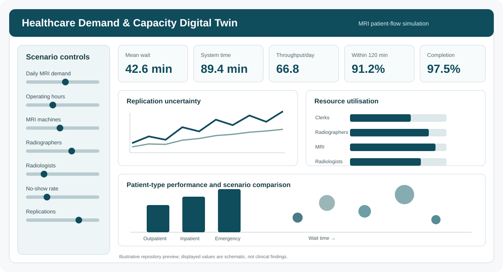
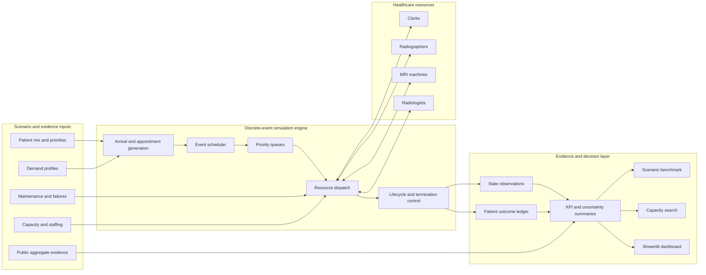
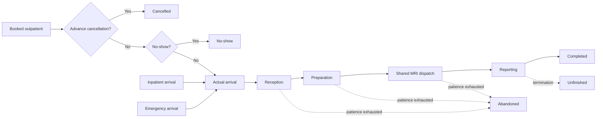

# Healthcare Discrete-Event Simulation

[](https://github.com/sauravsingla/healthcare-discrete-event-simulation/actions/workflows/ci.yml)
[](https://www.python.org/)
[](#testing-and-quality)
[](LICENSE)
[](https://doi.org/10.4236/ojmsi.2020.84007)
[](#dashboard-and-docker)

A research-grade Python healthcare digital twin for MRI demand forecasting, patient-flow simulation, capacity planning, queue analysis, resource utilisation and transparent staffing optimisation.

This repository implements and extends Saurav Singla (2020), **Demand and Capacity Modelling in Healthcare Using Discrete Event Simulation**, *Open Journal of Modelling and Simulation*, 8, 88–107.

- [Research paper](https://www.scirp.org/journal/paperinformation?paperid=102869)
- [DOI](https://doi.org/10.4236/ojmsi.2020.84007)
- [Validation protocol](docs/VALIDATION.md)
- [Engine guide](docs/ENGINE_GUIDE.md)
- [Validation status](docs/VALIDATION_STATUS.md)
- [Roadmap](docs/ROADMAP.md)

<p align="center">
  
</p>

## Key validated results

The repository has been benchmarked against official public NHS MRI activity data.

| External benchmark measure | Published result |
|---|---:|
| Monthly DM01 MRI activity tables | 12 |
| Providers represented | 463 |
| Months represented | 11 |
| Provider-month rows | 4,979 |
| Rows matched to MRI scanner capacity | 1,480 |
| Selected leakage-free baseline | `lag_1` |
| Validation WAPE — `lag_1` | 6.7826% |
| Validation WAPE — trailing three-month mean | 6.8400% |
| National holdout actual MRI activity | 840,480 |
| National holdout predicted MRI activity | 821,577 |
| National holdout absolute difference | 18,903 |
| **National holdout WAPE** | **2.2491%** |

### Easy interpretation

The benchmark asked a simple question: **how closely can the next period's MRI activity be estimated from recent NHS activity?**

The selected model predicted **821,577 MRI activities** against **840,480 actually delivered** during the unseen holdout period. The absolute difference was **18,903 activities**, giving a national WAPE of **2.2491%**.

In practical terms, this is an aggregate forecast difference of roughly **2 activities for every 100 actually delivered**.

The result supports five conclusions:

- **Strong national-level accuracy:** overall MRI activity was tracked closely during the unseen holdout period.
- **Recent activity was the best short-term signal:** the previous month (`lag_1`) slightly outperformed the trailing three-month average.
- **Useful for aggregate planning:** the result supports short-term demand and capacity planning at national or large-network level.
- **Provider-level performance varies:** median provider WAPE was 13.0128%; 68.5% of scored providers were at or below 20%, and 90.0% were at or below 50%.
- **External evidence improves credibility:** the benchmark used official NHS data across 463 providers rather than relying only on synthetic simulation inputs.

This benchmark is an external observational evaluation of the forecasting and evidence pipeline. It is **not** patient-level or clinical validation, and it should not be interpreted as an exact forecast for every provider, day or patient pathway.

Full evidence and provenance are retained in [`docs/benchmarks/nhs/2026-08-02/`](docs/benchmarks/nhs/2026-08-02/README.md).

## Why this project matters

Healthcare capacity decisions involve uncertain demand, patient priorities, shared resources, equipment downtime and queues that interact over time. This project converts those operational relationships into a reproducible discrete-event simulation so that alternative demand, machine, staffing and scheduling scenarios can be compared before real-world implementation.

The repository is designed as both a research implementation and an auditable decision-support framework. Assumptions, simulation logic, generated evidence and validation status are separated so that results can be reproduced, challenged and extended.

## What the repository provides

| Area | Capability |
|---|---|
| Demand | Outpatient, inpatient and 24-hour emergency arrivals |
| Patient flow | Reception, preparation, MRI scanning and reporting |
| Operational behaviour | Priorities, queues, cancellation, no-show, abandonment and unfinished patients |
| Capacity | MRI machines, radiographers, radiologists, clerks and dynamic staffing windows |
| Reliability | Maintenance, stochastic failure, repair and optional scan restart |
| Experimentation | Replications, bootstrap summaries, sensitivity analysis and scenario benchmarking |
| External evidence | NHS aggregate-data preparation, provenance and benchmark workflows |
| Delivery | Python package, four CLI entry points, Streamlit dashboard and Docker image |
| Quality | Linting, typing, coverage gate, wheel validation, Docker health checks and multi-version CI |

## Quick start

```bash
git clone https://github.com/sauravsingla/healthcare-discrete-event-simulation.git
cd healthcare-discrete-event-simulation
python -m venv .venv
source .venv/bin/activate  # Windows: .venv\Scripts\activate
pip install -e ".[dev,dashboard]"
healthcare-des --config configs/baseline.yaml --replications 20
```

Launch the dashboard:

```bash
streamlit run app.py
```

## Research contributions

Relative to a basic patient-flow simulation, this repository adds:

- outpatient, inpatient and emergency pathways sharing constrained MRI capacity;
- cancellation, no-show, abandonment and unfinished-patient accounting;
- calendar-aware and hourly demand profiles;
- dynamic staffing and operating windows;
- planned maintenance, stochastic MRI failure, repair and optional scan restart;
- configurable horizon, bounded-drain and full-drain termination policies;
- deterministic replications, bootstrap uncertainty and sensitivity analysis;
- capacity-search and transparent optimisation utilities;
- run-level patient ledgers and system-state observations;
- reproducible performance benchmarking across demand and capacity levels;
- official NHS aggregate-data preparation, provenance and external benchmarking;
- package, CLI, dashboard, Docker and continuous-integration delivery.

## Official NHS multi-source benchmark

The external-data workflow uses official public NHS sources for different evidence roles.

| Evidence family | Official input covered | Benchmark role |
|---|---|---|
| DM01 diagnostics | Monthly diagnostics activity extracts | Provider-month MRI activity and demand series |
| DID diagnostics | Modality/provider counts and pathway turnaround releases | Independent activity and turnaround evidence |
| NIDC assets | Imaging asset release | Provider-level MRI scanner capacity |
| NHS workforce | Workforce release | Workforce context for provider benchmarking |

The pipeline performs:

- source provenance and checksums;
- workbook and CSV schema discovery;
- provider-month MRI extraction;
- leakage-free temporal holdout;
- `lag_1` and trailing-mean baseline comparison;
- validation-WAPE model selection;
- provider-level scoring;
- optional scanner-capacity matching;
- machine-readable report generation.

The retained evidence records workflow run `30742975228`, source commit `b036068`, artifact ID `8831932312`, and artifact SHA-256 `4a91bc13ae9a038718f5591290189cd39dc9a97427078c123a311bf963a705fe`.

## Reproducible simulation benchmark

The advanced engine is also tested across **18 demand-capacity scenarios** and **36 measured runs**.

| Workload | Daily demand | MRI capacities | Scenario combinations | Measured runs |
|---|---:|---|---:|---:|
| Low demand | 35 patients/day | 1, 2, 4, 8, 12 and 20 | 6 | 12 |
| Baseline demand | 70 patients/day | 1, 2, 4, 8, 12 and 20 | 6 | 12 |
| Stress demand | 140 patients/day | 1, 2, 4, 8, 12 and 20 | 6 | 12 |
| **Total** | **3 demand levels** | **6 capacities per level** | **18** | **36** |

All scenarios completed successfully and preserve the lifecycle identity:

```text
arrivals = completed + abandoned + unfinished
```

The benchmark records runtime, patient-ledger volume and state-observation volume for every run. Fixed seeds with deterministic replication offsets make the comparisons repeatable.

> These workload datasets are synthetic simulation scenarios. They are separate from the official NHS external benchmark described above.

## System architecture



## Patient-flow model



`wait_minutes` is the sum of stage queue waits. `system_minutes` includes waiting and service time. Cancellation and no-show are recorded separately from patients who enter the physical service system.

## Example outputs

A typical experiment produces:

- mean and stage-specific waiting time;
- mean system time;
- throughput per day;
- completion rate and service-level attainment;
- patient-type performance;
- clerk, radiographer, MRI and radiologist utilisation;
- cancellation, no-show, abandonment and unfinished-patient counts;
- replication-level uncertainty and 95% confidence intervals;
- ranked capacity and staffing alternatives.

Generate deterministic examples with:

```bash
python examples/generate_example_outputs.py
```

Outputs:

```text
outputs/example_replications.csv
outputs/example_summary.csv
outputs/example_capacity_candidates.csv
```

## Which engine should I use?

| Engine | Intended use | Status |
|---|---|---|
| Base engine | Original YAML-driven workflow, standard scenario comparison and dashboard | Maintained for compatibility |
| Advanced engine | Rich lifecycle accounting, hourly demand, dynamic staffing, downtime, appointment schedules and configurable draining | Recommended for new research |

See [docs/ENGINE_GUIDE.md](docs/ENGINE_GUIDE.md) for detailed distinctions and migration guidance.

## Advanced engine example

```python
from dataclasses import replace
from healthcare_des import AdvancedScenarioConfig, run_advanced_once

config = replace(
    AdvancedScenarioConfig(),
    name="advanced-example",
    days=14,
    warmup_days=2,
    daily_demand=70,
    mri_machines=4,
    termination_policy="bounded_drain",
    max_drain_minutes=720,
    seed=17,
)

result, patients, state = run_advanced_once(config)
print(result)
print(patients["status"].value_counts())
assert result.arrivals == result.completed + result.abandoned + result.unfinished
```

A complete example is available in [`examples/advanced_workflow.py`](examples/advanced_workflow.py).

## Termination policies

- `horizon`: stop at the measurement horizon and report unfinished patients.
- `bounded_drain`: stop arrivals and allow up to `max_drain_minutes` for completion.
- `drain`: stop arrivals and continue while active patients remain.

Use the same policy across scenarios unless termination is itself the experimental factor.

## Command-line applications

```bash
healthcare-des --help
healthcare-des-benchmark --help
healthcare-des-reproduce --help
healthcare-des-advanced-benchmark --help
```

Standard scenario run:

```bash
healthcare-des --config configs/baseline.yaml --replications 20
```

Multi-scenario benchmark:

```bash
healthcare-des-benchmark \
  --config configs/baseline.yaml \
  --replications 20 \
  --output outputs/benchmark.csv
```

Advanced benchmark:

```bash
healthcare-des-advanced-benchmark \
  --days 7 \
  --replications 3 \
  --output outputs/advanced_benchmark.csv
```

## Capacity optimisation

```python
from healthcare_des.model import ScenarioConfig
from healthcare_des.optimisation import search_capacity

candidates = search_capacity(
    ScenarioConfig(days=14, warmup_days=2, daily_demand=70),
    replications=8,
)
print(candidates.head())
```

The optimiser uses illustrative weights. Replace them with locally validated cost, safety and workforce assumptions before operational use.

## Monte Carlo and sensitivity analysis

```python
from healthcare_des.model import ScenarioConfig
from healthcare_des.sensitivity import monte_carlo, one_at_a_time

base = ScenarioConfig(days=14, warmup_days=2)
uncertainty = monte_carlo(base, samples=50, replications=4)
sensitivity = one_at_a_time(base, replications=10)
```

## Dashboard and Docker

```bash
streamlit run app.py
```

```bash
docker build -t healthcare-des .
docker run --rm -p 8501:8501 healthcare-des
```

The dashboard exposes scenario controls, KPI cards, confidence intervals, replication uncertainty, resource utilisation, patient-type performance, scenario comparison and capacity search.

## Verification and validation

| Area | Current status |
|---|---|
| Software verification | Deterministic tests, accounting checks and CI implemented |
| Multi-version compatibility | Tested on Python 3.10, 3.11 and 3.12 |
| Package and CLI verification | Wheel build, clean installation and CLI smoke tests implemented |
| Dashboard deployment verification | Docker build and Streamlit health endpoint tested in CI |
| Repeated-experiment reproducibility | Fixed-seed and replication checks implemented |
| Public aggregate-data benchmark | Official NHS benchmark executed and results retained |
| Clinical deployment validation | Required locally before operational use |

The public-data workflow uses aggregate external data and stores no patient-level confidential or employer-owned information.

See [`docs/VALIDATION.md`](docs/VALIDATION.md), [`docs/VALIDATION_STATUS.md`](docs/VALIDATION_STATUS.md) and [`docs/VALIDATION_FRAMEWORK.md`](docs/VALIDATION_FRAMEWORK.md).

## KPI definitions

- **Booked:** outpatient appointments created before cancellation and no-show resolution.
- **Cancelled:** appointments cancelled before scheduled arrival.
- **Expected arrivals:** booked appointments remaining after advance cancellation.
- **No-shows:** expected outpatients who do not enter the service system.
- **Arrivals:** patients who enter the simulated service system.
- **Completed:** arrivals finishing all stages.
- **Abandoned:** arrivals leaving before completion after exhausting patience.
- **Unfinished:** arrivals still active when the selected termination policy ends.
- **Completion rate:** completed divided by actual arrivals.
- **Stage waits:** queue delay before reception, preparation, MRI and reporting.
- **Total wait:** sum of stage-specific queue waits.
- **System time:** elapsed time from actual arrival to final outcome.

## Repository structure

```text
.
├── src/healthcare_des/      # Simulation engines, experiments and analysis
├── tests/                   # Unit, integration and regression tests
├── examples/                # Reproducible usage examples
├── configs/                 # YAML scenario configurations
├── data/                    # Templates and non-sensitive aggregate inputs
├── docs/                    # Validation, benchmark and engine documentation
├── scripts/                 # Benchmarking and public-data workflows
├── outputs/                 # Generated machine-readable results
├── app.py                   # Streamlit dashboard entry point
├── pyproject.toml           # Package metadata, dependencies and CLI definitions
└── Dockerfile               # Reproducible container deployment
```

## Testing and quality

```bash
pre-commit run --all-files
ruff check src tests scripts examples
mypy src/healthcare_des
pytest --cov=healthcare_des --cov-report=term-missing --cov-fail-under=80
python -m build
twine check dist/*
```

CI runs quality checks on Python 3.10, 3.11 and 3.12. It validates CLI entry points, advanced-engine accounting, benchmark outputs, package metadata, wheel installation and Docker health.

## Assumptions and limitations

The project focuses on MRI patient flow rather than the entire radiology service. Default simulation values remain illustrative until calibrated against authoritative local operational evidence.

The NHS benchmark evaluates aggregate forecasting and data-processing performance. It does not establish patient-level accuracy, clinical effectiveness, causal impact or safe production deployment.

Real-world use requires independent validation of clinical pathways, workforce rules, costs, safety constraints, local capacity and governance requirements.

The model is a research and decision-support framework. It is not a clinical recommendation or a production scheduling system.

## Citation

```bibtex
@article{singla2020demand,
  title={Demand and Capacity Modelling in Healthcare Using Discrete Event Simulation},
  author={Singla, Saurav},
  journal={Open Journal of Modelling and Simulation},
  volume={8},
  pages={88--107},
  year={2020},
  doi={10.4236/ojmsi.2020.84007}
}
```

## Author

**Saurav Singla**

- [LinkedIn](https://www.linkedin.com/in/sauravsingla008/)
- [ORCID](https://orcid.org/0000-0002-6404-3988)
