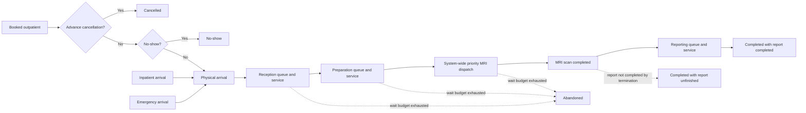
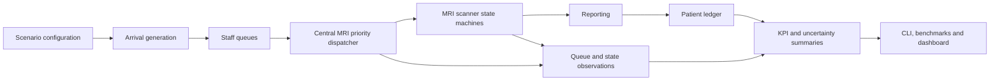

# Healthcare Discrete-Event Simulation

[](https://github.com/sauravsingla/healthcare-discrete-event-simulation/actions/workflows/ci.yml)
[](https://www.python.org/)
[](#testing-and-quality)
[](LICENSE)
[](https://doi.org/10.4236/ojmsi.2020.84007)
[](#dashboard-and-docker)

A reproducible Python platform for MRI demand forecasting, capacity planning, patient-flow simulation, queue analysis, resource utilisation and uncertainty analysis.

This repository modernises and extends Saurav Singla (2020), **Demand and Capacity Modelling in Healthcare Using Discrete Event Simulation**, *Open Journal of Modelling and Simulation*, 8, 88–107.

- [Research paper](https://www.scirp.org/journal/paperinformation?paperid=102869)
- [DOI](https://doi.org/10.4236/ojmsi.2020.84007)
- [Validation protocol](docs/VALIDATION.md)
- [Validation status](docs/VALIDATION_STATUS.md)
- [Engine guide](docs/ENGINE_GUIDE.md)
- [DES dispatch and lifecycle design](docs/DES_DISPATCH_AND_LIFECYCLE.md)
- [NHS benchmark evidence](docs/benchmarks/nhs/2026-08-02/README.md)

<p align="center">
  
</p>

## Current evidence

| Evidence | Result |
|---|---:|
| Official NHS providers represented | 463 |
| Provider-month MRI observations | 4,979 |
| National holdout actual MRI activity | 840,480 |
| National holdout predicted MRI activity | 821,577 |
| **National holdout WAPE** | **2.2491%** |
| Provider-level median WAPE | 13.0128% |
| Synthetic demand-capacity scenarios | 18 |
| Measured simulation runs | 36 |
| Supported Python versions | 3.10, 3.11 and 3.12 |
| Coverage policy | Whole package, minimum 80% |

The NHS result is an external aggregate forecasting benchmark. It does **not** validate patient-level DES behaviour, clinical safety or local operational readiness.

## Implemented capabilities and verified results

The following capabilities are implemented in the repository and were exercised by the merged CI workflow. Results distinguish software verification from external aggregate-data evidence.

| Implemented capability | What is available | Verified result or evidence |
|---|---|---|
| Patient demand generation | Outpatient appointments, inpatient arrivals and 24-hour emergency arrivals | All patient types execute through the advanced DES and reconcile in the patient ledger |
| Multi-stage patient flow | Reception, preparation, MRI scanning and reporting | End-to-end smoke test produced non-empty patient and state outputs with lifecycle reconciliation |
| System-wide MRI priority dispatch | Emergency before inpatient before outpatient | Priority-order regression tests passed |
| FIFO within each priority | Arrival sequence retained for patients with equal priority | Equal-priority FIFO regression tests passed |
| Multiple MRI scanners | Central dispatcher allocates across all available machines | Simultaneous scanner-release regression tests passed |
| Explicit queue measurement | Total MRI queue and emergency, inpatient and outpatient queue counts | Queue accounting tests passed; queue values are generated from the actual central waiting queue |
| Urgent-aware capacity reserve | Configurable protection of capacity when urgent demand is waiting | Reserve-behaviour regression tests passed |
| Dynamic staffing | Time-varying clerk, radiographer and radiologist capacity | Capacity reduction and token-accounting tests passed |
| Queue-wait patience | Waiting consumes patience; active service does not | Waiting-budget and deadline-boundary tests passed |
| Cancellation and no-show | Separate pre-arrival outcomes for booked outpatients | Included in lifecycle ledger and reconciliation tests |
| Abandonment | Stage-specific abandonment at reception, preparation or MRI waiting | Lifecycle and accounting tests passed |
| Scan and report separation | Scan completion is retained even when reporting remains unfinished | Reporting-status regression tests passed |
| Planned maintenance | `fixed_duration_after_release` and `fixed_calendar_window` policies | Maintenance-versus-dispatch timing tests passed |
| MRI failure and repair | Stochastic failure, active-scan interruption, repair and optional scan restart | Repeated failure and scan-interruption tests passed |
| Unique downtime accounting | Overlapping maintenance and failure blockers counted once | Downtime-overlap regression tests passed |
| Simulation termination policies | Horizon, drain and bounded-drain execution | Termination and unfinished-patient tests passed |
| Warm-up exclusion | Warm-up patients and state observations excluded from measured results | Warm-up-period tests passed |
| Deterministic replications | Seed plus replication index produces reproducible but distinct runs | Determinism and replication tests passed |
| Bootstrap uncertainty | Mean, standard deviation and 95% bootstrap intervals | Deterministic summary tests passed |
| Sensitivity analysis | Monte Carlo and one-at-a-time parameter analysis | Implemented in the package and covered by the test suite |
| Capacity comparison | Scenario benchmarking across demand and MRI-capacity combinations | 18 synthetic scenarios and 36 measured runs retained as evidence |
| Queueing-theory reference | Simplified stable-case comparison using Little's Law | Approximate Little's Law consistency test passed |
| External forecasting benchmark | Leakage-free transparent NHS MRI activity benchmark | National holdout WAPE 2.2491%; 821,577 predicted versus 840,480 observed |
| Provider-level benchmark | Provider-level holdout evaluation | Median provider WAPE 13.0128%; 68.5% at or below 20% WAPE |
| Public Python API | Basic and advanced simulation functions and result objects | Installed-package smoke test passed |
| Command-line applications | Scenario runner, benchmark runner, reproduction runner and advanced benchmark | All four installed CLI entry points passed `--help` checks |
| Research outputs | CSV, JSON metadata, figures, PDF/LaTeX/manifest-capable reporting workflows | Example outputs, benchmark metadata and README assets generated successfully in CI |
| Streamlit dashboard | Interactive scenario and result exploration | Container health endpoint passed |
| Docker deployment | Reproducible dashboard container | Image build, startup and endpoint verification passed |
| Python compatibility | Python 3.10, 3.11 and 3.12 | All three CI jobs passed |
| Repository quality | Ruff, Ruff Format, pre-commit and MyPy | All configured quality checks passed |
| Test suite | Unit, integration, regression, invariant and end-to-end tests | **188 tests passed** |
| Whole-package coverage | Coverage includes the complete `healthcare_des` package | **84.68% coverage**, above the 80% gate |
| Core advanced implementation coverage | Coverage of the legacy/internal advanced engine and public advanced model | Approximately **93%** and **96%**, respectively |
| Package distribution | Source distribution and wheel build | `python -m build`, `twine check` and clean-wheel installation passed |

### Decision outputs produced by the implementation

A simulation or benchmark run can produce:

- booked, cancelled, expected-arrival, no-show, physical-arrival, completed, abandoned and unfinished counts;
- completion rate and throughput per day;
- reception, preparation, MRI and reporting queue waits;
- total waiting time, system time and p90 system time;
- total and patient-type-specific MRI queue observations;
- mean and maximum queue length;
- MRI availability, failures and unique downtime;
- patient-level lifecycle records and machine assignment;
- system-state observations over time;
- replication-level results, standard deviations and bootstrap confidence intervals;
- scenario benchmark tables, ranked capacity alternatives and machine-readable metadata;
- charts, reports and dashboard views for exploratory analysis.

These outputs support scenario comparison and research experimentation. They must be calibrated and independently validated with local operational and patient-level evidence before real-world deployment.

## What the platform models

| Area | Capability |
|---|---|
| Demand | Outpatient, inpatient and 24-hour emergency arrivals |
| Patient flow | Reception, preparation, MRI scanning and reporting |
| Operational behaviour | System-wide priority dispatch, FIFO within priority, cancellation, no-show, abandonment and unfinished work |
| Capacity | MRI machines, radiographers, radiologists, clerks and dynamic staffing windows |
| Reliability | Planned maintenance, stochastic failure, repair and optional scan restart |
| Measurement | Explicit queue counts by patient type, lifecycle reconciliation and state observations |
| Experimentation | Replications, bootstrap summaries, sensitivity analysis and scenario benchmarking |
| Delivery | Python package, CLI applications, Streamlit dashboard and Docker image |
| Quality | Linting, typing, whole-package coverage, wheel checks, Docker checks and multi-version CI |

## Correctness-hardened DES behaviour

The public advanced implementation is `healthcare_des.advanced_model`. It owns the corrected runtime path directly and does not mutate `advanced_engine` globals at import time. This removes the previous import-order dependency and makes the public API deterministic.

### MRI dispatch

MRI allocation uses one system-wide priority queue:

1. emergency;
2. inpatient;
3. outpatient;
4. FIFO order within each priority class.

Queue metrics are measured from the explicit waiting queue and include total, emergency, inpatient and outpatient counts.

### Urgent-aware capacity reserve

`emergency_capacity_reserve` is an **urgent-demand-aware runtime reservation**, not a permanently idle scanner allocation. Routine patients may use available scanners when no urgent patient is waiting. When urgent demand is queued, the dispatcher protects the configured reserved share from routine allocation.

### Patience and reporting

`abandonment_minutes` is a queue-wait budget. Active service time does not consume patience. MRI scan completion and report completion are tracked separately: a scanned patient remains completed while `report_status` records whether reporting completed or remained unfinished.

### Maintenance and downtime

`maintenance_policy` supports:

- `fixed_duration_after_release`: the full maintenance duration starts after the scanner becomes available;
- `fixed_calendar_window`: maintenance ends at the configured calendar-window end.

Overlapping maintenance and failure blockers are integrated as one unavailable interval, preventing double-counted downtime.

## Patient-flow model



The accounting identity is enforced:

```text
arrivals = completed + abandoned + unfinished
```

## Architecture



The public advanced module owns the corrected model, machine classes and run functions. The older `advanced_engine` module remains an internal compatibility base only; importing the public module does not monkey-patch it.

## Quick start

```bash
git clone https://github.com/sauravsingla/healthcare-discrete-event-simulation.git
cd healthcare-discrete-event-simulation
python -m venv .venv
source .venv/bin/activate  # Windows: .venv\Scripts\activate
pip install -e ".[dev,dashboard]"
healthcare-des --config configs/baseline.yaml --replications 20
```

Launch the dashboard:

```bash
streamlit run app.py
```

## Advanced engine example

```python
from dataclasses import replace
from healthcare_des import AdvancedScenarioConfig, run_advanced_once

config = replace(
    AdvancedScenarioConfig(),
    name="advanced-example",
    days=14,
    warmup_days=2,
    daily_demand=70,
    mri_machines=4,
    emergency_capacity_reserve=0.15,
    maintenance_policy="fixed_calendar_window",
    termination_policy="bounded_drain",
    max_drain_minutes=720,
    seed=17,
)

result, patients, state = run_advanced_once(config)
print(result)
print(patients["status"].value_counts())
assert result.arrivals == result.completed + result.abandoned + result.unfinished
```

## Command-line applications

```bash
healthcare-des --help
healthcare-des-benchmark --help
healthcare-des-reproduce --help
healthcare-des-advanced-benchmark --help
```

Run an advanced benchmark:

```bash
healthcare-des-advanced-benchmark \
  --days 7 \
  --replications 3 \
  --output outputs/advanced_benchmark.csv
```

## Dashboard and Docker

```bash
streamlit run app.py
```

```bash
docker build -t healthcare-des .
docker run --rm -p 8501:8501 healthcare-des
```

## Verification and validation

The repository distinguishes software verification from external and clinical validation.

| Area | Current status |
|---|---|
| Priority and FIFO behaviour | Regression tested |
| Simultaneous scanner release | Regression tested |
| Maintenance-versus-dispatch timing | Regression tested |
| Timeout-versus-dispatch boundary | Regression tested |
| Repeated scan interruption and repair | Regression tested |
| Import-order independence | Regression tested |
| Queue accounting | Explicit and regression tested |
| Whole-package coverage | Minimum 80%, no core-engine omission |
| Multi-version compatibility | Python 3.10, 3.11 and 3.12 |
| Package and CLI verification | Wheel build, installation and CLI smoke tests |
| Dashboard deployment | Docker build and Streamlit health check |
| External aggregate benchmark | Official NHS benchmark completed and versioned |
| Patient-level local validation | Required before operational deployment |
| Clinical safety validation | Required locally before operational use |

A simplified stable workload also checks approximate consistency with Little's Law. This is a software-verification reference, not a substitute for calibration against real patient-flow data.

## Testing and quality

```bash
pre-commit run --all-files
ruff check src tests scripts examples
mypy src/healthcare_des
pytest --cov=healthcare_des --cov-report=term-missing --cov-fail-under=80
python -m build
twine check dist/*
```

Coverage applies to the complete `healthcare_des` package. The core/compatibility engine is no longer omitted from measurement.

CI exercises Python 3.10, 3.11 and 3.12, repository-wide pre-commit checks, linting, typing, targeted regressions, strict whole-package coverage, installed CLI entry points, benchmark smoke tests, wheel installation, Docker build and the Streamlit health endpoint.

## Official NHS external benchmark

The repository includes an end-to-end external benchmark using official public NHS aggregate data. The selected transparent `lag_1` baseline achieved **2.2491% national holdout WAPE**, predicting 821,577 MRI activities against 840,480 observed.

Provider-level performance is more variable. The median provider WAPE was 13.0128%, with 68.5% of evaluated providers at or below 20% WAPE. Full versioned evidence and provenance are available in [`docs/benchmarks/nhs/2026-08-02/`](docs/benchmarks/nhs/2026-08-02/README.md).

## Assumptions and limitations

The project focuses on MRI patient flow rather than the entire radiology service. Default assumptions are illustrative until calibrated against authoritative local evidence.

The external NHS benchmark evaluates aggregate forecasting and evidence-processing capability. It does not demonstrate patient-level accuracy, causal impact, clinical safety or production scheduling readiness.

Real-world use requires independent validation of local pathways, workforce rules, costs, service targets, safety constraints, data quality and governance requirements.

## Repository structure

```text
.
├── src/healthcare_des/      # Simulation, experiments and analysis
├── tests/                   # Unit, integration and regression tests
├── examples/                # Reproducible usage examples
├── configs/                 # YAML scenario configurations
├── data/                    # Templates and non-sensitive aggregate inputs
├── docs/                    # Validation, benchmark and engine documentation
├── scripts/                 # Benchmarking and public-data workflows
├── outputs/                 # Generated machine-readable results
├── app.py                   # Streamlit dashboard entry point
├── pyproject.toml           # Package, tooling and coverage configuration
└── Dockerfile               # Reproducible container deployment
```

## Citation

```bibtex
@article{singla2020demand,
  title={Demand and Capacity Modelling in Healthcare Using Discrete Event Simulation},
  author={Singla, Saurav},
  journal={Open Journal of Modelling and Simulation},
  volume={8},
  pages={88--107},
  year={2020},
  doi={10.4236/ojmsi.2020.84007}
}
```

## Author

**Saurav Singla**

- [LinkedIn](https://www.linkedin.com/in/sauravsingla008/)
- [ORCID](https://orcid.org/0000-0002-6404-3988)
