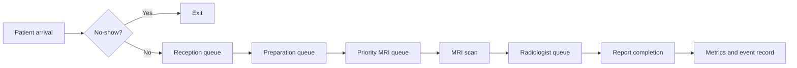

# Architecture

## Purpose

The project models MRI patient flow as a sequence of stochastic service stages. It is intended for reproducible demand-and-capacity experiments rather than clinical decision-making.

## Patient flow

Emergency patients receive the highest MRI queue priority, followed by inpatients and outpatients. Reception, radiographer, scanner and radiologist capacities are independently configurable.

## Main components

- `ScenarioConfig`: immutable model assumptions and resource capacities.
- `MRIModel`: SimPy resources, patient lifecycle and event collection.
- `run_once`: one deterministic replication for a configuration and seed.
- `run_replications`: repeated experiments for uncertainty analysis.
- `synthetic`: privacy-safe demand generation.
- `optimisation`: explicit capacity search over candidate configurations.
- `sensitivity`: one-at-a-time and Monte Carlo experiments.
- `dashboard`: interactive Streamlit scenario exploration.

## Reproducibility

Each replication derives its random-number generator from the configured seed and replication index. Tests use small seeded scenarios to validate deterministic behaviour.

## Boundaries

The current model does not represent detailed clinical pathways, equipment failures, staff breaks, shift handovers, costs, downstream treatment, patient outcomes or multi-site transfers. These should be added only with documented evidence and validation targets.
